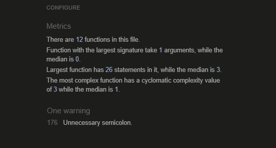

# Quiz Game
## Overview
This website is the second project in the Code Institute course.

It showcases various programming skills and methods that I acquired during the course. 

Main languages used HTML, CSS, and JavaScript.
    

## About Website
The quiz is designed to test general knowledge in various topics.

Quiz consists of 21 questions from the following categories:
* Arts
* Music
* History
* Sports
* Literature
* Geography
* Science
  
* Each question is randomly selected from the categories above.
* Each question has a time limit of 15 seconds.
* If you don’t answer within the allotted time, the question is marked as incorrect.
* After all, 21 questions, you receive your score.
* The quiz can be reset, and you can improve your score.

       

### Deployed website can be found here - [Quiz Game](https://aleksandrdenis.github.io/PP2-Quiz-Game/)

# Index
1. [UX](#ux)
   1. [User Stories](#user-stories)
   2. [Design](#design)
      1. [Structure](#structure)
      2. [Wireframes](#wireframes)
      3. [Color Scheme](#color-scheme)
      4. [Typography](#typography)
      5. [Images](#images)
3. [Deployment](#deployment)
4. [Features](#features)
   1. [Finished Product](#finished-product)
   2. [Features Possible To Implement](#features-possible-to-implement)
6. [Testing](#testing)
   1. [Testing User Stories](#testing-user-stories)
   2. [Responsive Web Design](#responsive-web-design-testing)
   3. [Manual Testing](#manual-testing)
   4. [Validator Testing](#validator-testing)
   5. [Bugs](#bugs)
8. [Languages and Programs](#languages-and-programs)
9. [Learning Outcomes](#learning-outcomes)
10. [Credits](#credits)
    1. [Code](#code)
    2. [Content](#content)
    3. [Media](#media)
11. [Acknowledgements](#acknowledgements)

# UX
## User Stories
* User
  * As a user, I want to play an online quiz to test my general knowledge in variety of topics.
  * As a user, I want see my progress.
  * As a user, I want track my score.
  * As a user, I want see my final result.
  * As a user, I want improve my score.
* Owner Goal
  * As an Owner, I wont improve a challenging quiz to entertain online users.

# Design
### Structure

The website’s structure is intuitive, facilitating a natural user flow.
### Wireframes

### Color Scheme
The primary background color, RGB(241, 241, 239), exudes a light and understated elegance, providing a tranquil and soothing ambiance ideal for backgrounds.

Linear-gradient(to right, rgba(0, 238, 255, 0), rgb(0, 162, 255)) where added to quize page. This creates a visual effect where the light blue color gradually appears from the left, becoming fully opaque towards the right. 
I used it to add a subtle design element to page.

Conversely, the text color RGB(70, 68, 68) offers a stark contrast with its dark, subdued tones, ensuring optimal legibility against the lighter backdrop.
### Typography
The ‘Courier New’, Courier, monospace font is a monospaced typeface favoured in web design for its classic typewriter aesthetic, which harmonizes with the quiz interface to enhance the overall design
### Images
Illustrations accompanying the quiz questions were designed to be both fun and appealing, serving as visual aids that correspond to the category of each question. 

# Deployment
More information can be found here [GitHub Docs](https://docs.github.com/en/pages/getting-started-with-github-pages/creating-a-github-pages-site)
* The site was deployed to GitHub pages. The steps to deploy are as follows:
   1. In GitHub repository, navigate to the settings tab.
   2. From side menu select pages tab.
   3. Once there select source branch:main, select folder/(root).
   4. Click save, the page provided the link to the completed website.     
* The live link can be found here  [Quiz Game](https://aleksandrdenis.github.io/PP2-Quiz-Game/)

# Features
**All features have been meticulously included, enhancing the user experience and delivering exceptional value to user**
## Home Page

* The home page serves as the entry point for users.
* Displays a welcome message "Its Quiz Time"
* Includes buttons for gameplay and rules:
  * Buttons
    * “Let’s Play” Button:
      * When clicked, it starts the quiz game.
      * Redirects the user to the quiz questions page.
    * “Rules” Button:
      * When clicked, it takes the user to the rules page.
      * The rules page explains how the game works, scoring, and any other relevant information.
## Quiz Questions Page:

* This page displays the quiz questions one by one.
* Each question has multiple-choice answers.
* Users select an answer and proceed to the next question.
* Keep track of the user’s score.
* Timer bar each question has time limit user can visually track progress.
## Question Flow:
* Show the current question.
* Displays answer options.
  * When the user selects an answer:
    * Check if it’s correct.
* Update the score accordingly.
* Move to the next question.
* Repeats until all questions are answered.
## End of Quiz

* Once all questions are answered:
  * Ask user to input name    
  * Display the final score.
  * Show a personal congratulatory message to user.
## Rules Page:

* Explain the game rules:
  * How many questions are there?
  * Scoring system.
  * Time limit.
  * Penalties for wrong answers and if time runs out.
* Includes a button to Star quiz.
## Finished Product

Page | Desktop | Mobile 
--- | --- | --- 
Home |  | 
Quiz |  | 
End Quiz |  |  
Rules |   | 
## Features Possible To Implement
* Possible features to enhance the quiz experience include:
  * Implementing a high-score leaderboard
  * Allowing users to test their knowledge in specific categories beyond general knowledge.

# Testing
## Testing User Stories
 * As a user, I want to play an online quiz to test my general knowledge in variety of topics.
   * Questions are displayed, and users can submit answers.  
  * As a user, I want see my progress.
    * Progress indicators  are visible during the quiz.
  * As a user, I want track my score.
    * Scoring mechanism works accurately.    
  * As a user, I want see my final result.
    * Final score is displayed at the end of the quiz with congratulatory message.         
  * As a user, I want improve my score.
    * User can retake quizzes to improve their scores.
## Responsive Web Design Testing
* [Responsive Design Checker](https://www.responsivedesignchecker.com/) was used to test the responsiveness of the website on various screen sizes and devices:
  
Screen Size | Device  
--- | --- 
  1920x1200 | Desktop
  1920x1080 | Desktop
  1680x1050 | Desktop
  1600x900  | Desktop
  1440x900 | Desktop
  1366x768 | Notebook
  1024x800 | Notebook
  1024x600 | Notebook
  1366x1024 | Apple iPad Pro
768x1024 | Amazon Kindle Fire
768x1024 | Asus Eee 1000
600x960 | Nexus 7
1024x768 | Nexus 9
800x12 | Samsung Galaxy Tab 10
320x480 | Apple iPhone 3/4/4s
320x568 | Apple iPhone 5/5s
375x667 | Apple iPhone 6/6s/7
414x736 | Apple iPhone 6s Plus / 7 Plus
360x640 | Samsung Galaxy S5/S6/S7
360x640 | Sony Xperia Z2/Z3
411x731 | Google Pixel
384x640 | Nexus 4
411x731 | Nexus 5
411x731 | Nexus 6

* [Chrome DevTools](https://developer.chrome.com/docs/devtools/) was used to test responsiveness in different screen sizes during the development process.
## Manual Testing 
### Homepage and Links:
* I verified that the homepage loads successfully.
* I checked buttons to access different sections of the website "Lets Play" and "Rules" redirect user to correct page.
### Rules:
* I verified that the rules page loads successfully.
* I verified all content displayed as intended.
* I verified that "Lets Play" button redirects user to quiz.
###  Start Quiz Functionality:
* I Clicked on "Lets Play" and its start quiz.
* I confirmed that the quiz begins and questions are displayed.
* I answered all questions to confirm they function correctly.
* I checked timer works correctly.
### Question Display and Interaction:
* I checked that all images represent categories correctly.
* I verified that questions are presented clearly.
* I tested that users can select answers.
### Score Tracking and Progress:
* I checked score is updated as users answer questions.
* I confirmed that progress indicator are accurate.
### Result and End Quiz:
* I checked that prompt messages works as intended.
* I verified that users’ scores are recorded and displayed to user.
* I verified users can view their score and personalized feedback message displayed.
* I verified that "Lets Play" button displayed and redirects user to home page.
### Cross-Browser Compatibility Testing:
 * Edge 
     * Layout and responsiveness: No critical issues were identified.
     * Functionality and performance: No critical issues were identified.
     * Accessibility and usability: No critical issues were identified.
     * Visual appearance and design: No critical issues were identified.
        
* Firefox
     * Layout and responsiveness: No critical issues were identified.
     * Functionality and performance: No critical issues were identified.
     * Accessibility and usability: No critical issues were identified.
     * Visual appearance and design: No critical issues were identified.
       
* Chrome 
     * Layout and responsiveness: No critical issues were identified.
     * Functionality and performance: No critical issues were identified.
     * Accessibility and usability: No critical issues were identified.
     * Visual appearance and design: No critical issues were identified.

  [Back To Top](#quiz-game)

## Validator Testing
* HTML
   * No errors were returned when passing the official [W3C](https://validator.w3.org/) validator.
 
   
 

 

    
* CSS
   * No errors were found when passing through the official [Jigsaw](https://jigsaw.w3.org/css-validator/) validator.
   

    

            
* JS
  * No errors. Warnings regarding use of "const" and "let" which is an ES6 feature,  were returned when passing through the the [JSHint](https://jshint.com/) Validator.
    
    

 * Accessibility
 * I confirmed that website preforms highly, running through  lighthouse devtools. Colors and fonts being used in throughout the website are easy to read and accessible.

   
   
   

   
       

# Bugs
When using Math.random() method to shuffle question array answers where shuffled to witch led to correct answers marked as incorrect.
To Fix it i used Fisher-Yates algorithm on array.

# Languages and Programs
* [HTML5](https://en.wikipedia.org/wiki/HTML5)
   * Used for structure.
* [CSS](https://en.wikipedia.org/wiki/CSS)
   * Used for styling.
* [JavaScript](https://en.wikipedia.org/wiki/JavaScript)
  * Used for create dynamic and interactive web page.
*  [Vs Code and Codespaces](https://en.wikipedia.org/wiki/Visual_Studio_Code)
  * Used as code editor.
* [MS Word](https://en.wikipedia.org/wiki/Microsoft_Word)
  * Used to write content and detect grammatical errors in a text.

# Credits
## Code
* [Mmdn](https://developer.mozilla.org/en-US/) and [W3Schools](https://www.w3schools.com/) were consulted on a regular basis to  understand the code being implement.
*  Shuffle the questions array using Fisher-Yates algorithm was used from  [Programming-algorithms.net](https://www.programming-algorithms.net/article/43676/Fisher-Yates-shuffle)
*  Rest of the  code was written by the developer.
## Content
* All content was written by the developer.
## Media
* Images where design by developer using [Microsoft Designer](https://designer.microsoft.com/)

# Acknowledgements
* Code Institute and its amazing Slack community for their support and providing me with the necessary knowledge to complete this project.
* My tutor, Marcel, for his invaluable feedback and guidance.

[Back To Top](#quiz-game)

